> [!success] Project Status: Complete
> All 8 planned steps implemented, tested, and running. LLM-powered analysis layer added. Dashboard live with 5 interactive pages.

---

## What Was Built

A **multi-level anomaly detection framework** for AIMD trajectories of 2D Sb₂Te₃ with Cr dopants — dual purpose:

1. **Scientific result** for the [[npj 2D Materials paper]] — quantifies where MLFF deviates from DFT-level physics
2. **Interview portfolio** for a [[Qualcomm Summer 2026 internship]] (HLM game debugging team)

---

## Key Results

> [!example] Detection Performance
>
> | Metric                     | Value                     |
> | -------------------------- | ------------------------- |
> | AIMD anomaly rate (L1+L2)  | **3.6%** ✅ (expected ~5%) |
> | MLFF anomaly rate (L1+L2)  | **100%** ✅                |
> | Detection ratio            | **27.9×**                 |
> | LSTM val loss              | 0.137 (converged epoch 46) |
> | LSTM anomaly threshold     | 0.202 (95th pct)          |
> | Features extracted         | **22** per window         |
> | Total AIMD windows         | 1,648                     |
> | Total MLFF windows         | 799                       |

---

## Architecture Overview

```mermaid
graph TD
    A["Raw .xyz files\n25,054 frames"] --> B["TrajectoryLoader\nsrc/core/loaders.py"]
    B --> C["FeatureExtractor\n22 features · window=50 · stride=10"]
    C --> D1["Level 1\nStatistical 3σ"]
    C --> D2["Level 2a\nIsolation Forest"]
    C --> D3["Level 2b\nOne-Class SVM"]
    C --> D4["Level 3\nLSTM Autoencoder"]
    D1 & D2 & D3 --> E["Ensemble Vote\n≥2 detectors = anomaly"]
    D4 --> E
    E --> F["Streamlit Dashboard\n5 pages + AI Analysis"]
    F --> G["glm-5:cloud via Ollama\nNL queries · Code gen · Mechanism analysis"]
```



---

## Files Created

### Core Modules

| File | Description |
| ---- | ----------- |
| `src/core/loaders.py` | `TrajectoryLoader` — parses `.xyz` files → `(n_frames, n_atoms, 3)` |
| `src/core/feature_extractors.py` | 22 aggregate features, sliding windows, atom-count-agnostic |
| `src/core/detectors.py` | `AnomalyDetectionFramework` — L1 + L2 ensemble, serialisable |
| `src/core/models.py` | `LSTMAnomalyDetector` — PyTorch LSTM encoder→bottleneck→decoder |
| `src/core/llm_analyst.py` | `OllamaAnalyst` — code gen, safe `exec()`, mechanism analysis |

### Pipeline & Dashboard

| File | Description |
| ---- | ----------- |
| `scripts/run_full_pipeline.py` | End-to-end: extract → train → evaluate → save all outputs |
| `app/dashboard.py` | Streamlit 5-page dashboard |

### Config & Docs

| File | Description |
| ---- | ----------- |
| `CLAUDE.md` | AI assistant context: env, paths, design decisions, interview info |
| `~/.claude/commands/anomaly-demo.md` | `/anomaly-demo` custom skill — generalises to any time-series domain |
| `README.md` | Project documentation |

---

## Dashboard Pages

> [!abstract] 5 Interactive Pages

### Page 1 — 📊 Data Overview

- File inventory table with atom counts, temperatures, configurations
- Bar charts: windows per file, windows by temperature

### Page 2 — 🔍 Feature Analysis

- 4 tabs: Distributions · Importance & Correlation · Interactive Explorer · Statistics Table
- Interactive feature selector with histogram + time-series + z-score metric

### Page 3 — ⚠️ Anomaly Detection *(enhanced)*

- Full confidence timeline (AIMD or MLFF selectable)
- **🔎 Dynamic Window Zoom** — range slider → zoomed confidence + per-detector flag heatmap (3×N) + top-8 feature deviation bar chart
- "Ask AI" expander: LLM explains the selected window region
- Threshold slider, confidence distribution, LSTM training curve

### Page 4 — ⚖️ AIMD vs MLFF

- Z-score deviation bar chart, side-by-side distributions
- Full comparison table with colour gradient on z-score
- CSV download buttons

### Page 5 — 🤖 AI Analysis *(new)*

- Natural language query → `glm-5:cloud` generates matplotlib code → executes against real data → displays figure
- 3 modes: Generate Figure / Mechanism Analysis / Both
- 5 quick pre-built analyses (one-click)
- Full data context viewer (shows exactly what the LLM receives)

---

## Feature Engineering

22 features, all atom-count-agnostic (aggregate over atoms → works for 80–86 atom systems):

| Category | Features |
| -------- | -------- |
| **Displacement stats** (7) | `disp_mean`, `disp_std`, `disp_skew`, `disp_kurtosis`, `disp_max`, `disp_median`, `disp_p95` |
| **Dynamics** (5) | `rms_velocity`, `crest_factor`, `impulse_factor`, `frame_variance`, `anisotropy` |
| **Frequency domain** (3) | `dominant_freq`, `spectral_entropy`, `spectral_peak_ratio` |
| **MSD** (4) | `msd_mean`, `msd_std`, `msd_final`, `msd_slope` |
| **Energy** (3) | `energy_mean`, `energy_std`, `energy_trend` |

---

## LLM Component

> [!info] Anti-Hallucination Design
> Every mechanism claim must cite a specific computed value in `► Claim: ... | Evidence: [value]` format. Figures are produced by executing code against real numpy arrays — they cannot be fabricated.
>
> Tested live: `disp_median AIMD=0.0029, MLFF=17.0522, z=+7212.93` cited correctly.

- **Model:** `glm-5:cloud` via Ollama (local)
- **Code generation:** LLM writes Python → `exec()` in sandboxed namespace with real data arrays
- **Error retry:** automatic once on failure with error feedback
- **Mechanism analysis:** structured `## Observed Pattern / ## Physical Mechanism / ## Key Features / ## Limitations` with evidence citations

---

## All Outputs Generated

```
data/processed/
  features_aimd.npz            1,648 × 22 feature matrix
  features_mlff.npz              799 × 22 feature matrix
  pipeline_summary.json         key metrics + config
  meta_aimd.csv / meta_mlff.csv per-window metadata

results/models/
  anomaly_framework.pkl         trained L1+L2 ensemble
  lstm_autoencoder.pt           trained LSTM (epoch 46)
  lstm_scaler.pkl               StandardScaler for LSTM input

results/figures/
  feature_distributions.png     violin plots AIMD vs MLFF
  feature_importance.png        RF importance bar chart
  feature_correlation.png       22×22 correlation heatmap
  anomaly_timeline.png          confidence over time
  detector_agreement.png        per-detector anomaly rates
  lstm_training.png             train/val loss curves

results/reports/
  ensemble_comparison.csv       per-window results (2,447 rows)
  feature_comparison.csv        22-feature AIMD vs MLFF statistics
  aimd_vs_mlff_analysis.md      narrative findings
```

---

## Qualcomm / HLM Interview Alignment

> [!tip] Interview Framing
> **Role:** Qualcomm Summer 2026 Intern · HLM game debugging team · 11–14 weeks May–Sep 2026
>
> **Pitch:** "Same detection algorithm, swap the data loader. Built on AIMD trajectories, applies directly to game profiler output."

| JD Requirement | How This Project Demonstrates It |
| -------------- | -------------------------------- |
| AI/Machine Learning | 3-level ensemble: statistical + IF + SVM + LSTM autoencoder |
| LLMs | `glm-5:cloud` integration for NL analysis and code generation |
| Python & frameworks | PyTorch, scikit-learn, Streamlit, Ollama, pandas, scipy |
| Debugging tools | Anomaly detection *is* the debugging automation |
| Data Structures & Algorithms | Sliding windows, FFT, feature extraction pipeline |

---

## How to Run

```bash
# Full pipeline (~2 min)
/Users/alina/anaconda3/envs/agentic/bin/python scripts/run_full_pipeline.py

# Dashboard (Ollama must be running for Page 5)
/Users/alina/anaconda3/envs/agentic/bin/streamlit run app/dashboard.py
```

> [!warning] Known Issue
> `conda run -n agentic` fails with a `libarchive.19.dylib` error. Always use the **full Python path**: `/Users/alina/anaconda3/envs/agentic/bin/python`

---

## Step Completion Log

- [[STEP1_COMPLETION]] — Data loading + quality assessment ✅
- [[STEPS_2_8_COMPLETION]] — Feature extraction → detectors → LSTM → dashboard ✅
- LLM component (`llm_analyst.py` + Page 5 dashboard) — added after Steps 2–8 ✅
- `CLAUDE.md` + `/anomaly-demo` skill — project memory + generalisation tool ✅
- Qualcomm interview context updated ✅

---

## Top Scientific Finding

The MLFF trajectory shows `disp_median = 17.05 Å` vs AIMD `0.003 Å` (**z = +7213**), indicating the machine-learned force field produces ==catastrophic atomic displacements== — atoms move thousands of times further per timestep than DFT predicts. This manifests as 100% anomaly detection across all three detector levels.

---

*Generated 2026-02-13 · See [[CLAUDE.md]] for AI assistant context*
